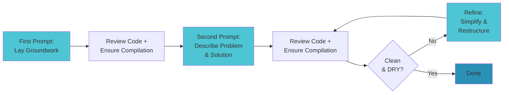

# Working with AI Agents in Code

A Practical Guide for Developers

---
layout: center
---

# Executive Summary

<v-clicks>

- **Treat AI like a talented intern**: Knowledgeable about patterns, but needs guidance and review

- **Start simple, iterate deliberately**: Break work into small steps, review after each change

- **Always verify and refine**: Review code thoroughly, ensure it compiles, and iterate until clean

- **Manage context strategically**: More examples = better output, but stay focused on one task

- **Leverage existing patterns**: Point to working code to guide the AI in the right direction

</v-clicks>

<!--
These five principles will guide your entire workflow with AI agents
-->

---
layout: two-cols
---

# General Tips

Think of the AI agent as...

<v-clicks>

**A very knowledgeable developer who has never actually coded before**

- Knows common patterns and solutions
- Needs context and examples
- Makes mistakes that need review
- Can explain and explore ideas

</v-clicks>

::right::

<v-clicks>

<div class="mt-12">

## Key Practices

**Always review the output**
- Just like code reviews with humans
- Understand what was written and why

**Ask questions**
- Modern LLMs are great at answering questions
- Explore ideas before implementing

**Always refine**
- "Is there a simpler way to do this?"
- Don't accept the first solution

</div>

</v-clicks>

<!--
These aren't optional - they're essential to working effectively with AI
-->

---
layout: center
---

# The Iterative Process

<div class="text-sm" style="transform: scale(0.75); transform-origin: center;">



</div>

<!--
This cycle is the foundation of effective AI-assisted development
-->

---

# First Prompt: Lay the Groundwork

**Goal**: Set up the environment without doing too much at once

<v-clicks>

## What to do

- **Keep it simple**: Don't ask the agent to do too much initially
- **Set up structure**: Create files, directories, routes, empty components
- **Establish context**: Define where the agent should be working

## Why this matters

Asking the agent to do too much in the first step causes it to get off track quickly.

If you're not sure exactly how to solve the problem, ideate in a separate conversation first.

</v-clicks>

<!--
Think of this as scaffolding - you're building the frame before adding the details
-->

---

# After the First Prompt

<v-clicks>

## Critical checkpoints

**1. Review the code in detail**
- Read through everything generated
- Make sure you understand what was created
- Check for any obvious issues or deviations

**2. Make sure the app compiles**
- Run the build/dev server
- Fix any immediate compilation errors
- Verify the structure is sound

</v-clicks>

<v-click>

<div class="mt-8 p-4 bg-yellow-100 dark:bg-yellow-900 rounded">

⚠️ Never proceed to the next step if the code doesn't compile or you don't understand what was generated

</div>

</v-click>

<!--
This is your first quality gate - don't skip it
-->

---

# Second Prompt: Describe the Solution

**Goal**: Provide detailed requirements and guide the implementation

<v-clicks>

## 1. Describe the problem in detail

Explain what you're solving, then describe the solution you want to see:
- Component inputs and outputs
- What services should do
- Expected behavior and output

## 2. Share guiding information

**Point to existing files with patterns you want to follow**
- Use file paths to reference working code
- Modern agents can parse and learn from existing patterns
- Providing working code is the best way to guide output

</v-clicks>

<!--
This is where you leverage context to get better results
-->

---

# Second Prompt (continued)

<v-clicks>

## 3. Roll the dice

Let the agent implement the solution based on your detailed description

<div class="mt-8">

### Example prompt structure

```markdown
I need to implement user authentication for the dashboard.

The solution should:
- Create an AuthService with login/logout methods
- Add a LoginComponent with email/password fields
- Store tokens in localStorage
- Redirect to /dashboard on success

Please follow the patterns in `src/services/api.service.ts`
for service structure and error handling.
```

</div>

</v-clicks>

<!--
Be specific about what you want and what patterns to follow
-->

---

# After the Second Prompt

<v-clicks>

## 1. Review the code in detail

Read through all generated code carefully
- Does it match your requirements?
- Are there any security issues?
- Does it follow the patterns you referenced?

## 2. Make sure it compiles

Run the build again
- Fix any new compilation errors
- Test the functionality

## 3. Suggest ways to refine

Don't stop at working code - make it better
- "Move this function to a service"
- "Extract this logic into a utility function"
- "Can we simplify this conditional?"

**Repeat until the output is clean and easy to read**

</v-clicks>

<!--
This is your second quality gate and the start of refinement
-->

---
layout: two-cols
---

# Handling Errors

<v-clicks>

## The simple approach

**Copy and paste console errors into the prompt**

The agent can often resolve them directly

## Include context

- Line numbers from errors
- Stack traces
- Runtime vs compilation errors

</v-clicks>

::right::

<v-click>

<div class="mt-12">

### Example

```
I'm getting this error:

TypeError: Cannot read property 'map'
of undefined
    at UserList.tsx:42

The users array should be populated
from the API call but it's undefined.
```

<div class="mt-4 p-3 bg-green-100 dark:bg-green-900 rounded text-sm">

✅ Most errors can be resolved by simply sharing the error message and context

</div>

</div>

</v-click>

<!--
Error handling with AI is surprisingly effective when you provide good context
-->

---

# Context Management

<v-clicks>

## More examples = better output

**The more examples of good code in context, the better**
- Reference existing files when possible
- Point to patterns you want followed
- Include working implementations as examples

## But too much context can be bad

**Keep your session focused**
- One task per session
- Start a new session when switching topics
- Don't let context become cluttered with unrelated code

</v-clicks>

<v-click>

<div class="mt-8 p-4 bg-blue-100 dark:bg-blue-900 rounded">

💡 Think of context like RAM - more is better, but only if it's relevant to the current task

</div>

</v-click>

<!--
Balance is key - enough context to guide, not so much to confuse
-->

---

# Refinement Strategies

<v-clicks>

## The DRY Problem

**LLMs often write new content before reusing existing content**

This leads to code duplication

## How to address it

- **Identify duplicate code**: Look for repeated patterns
- **Ask for consolidation**: "Move this function to a shared service"
- **Request utility methods**: "Extract this logic to a utility"
- **Enforce patterns**: "This duplicates code in X, please reuse that instead"

</v-clicks>

<v-click>

<div class="mt-6">

### Example refinement prompt

```markdown
I notice the date formatting logic is duplicated in three places.
Can you create a formatDate utility in src/utils/date.ts
and replace all instances with calls to that function?
```

</div>

</v-click>

<!--
Refinement is where good code becomes great code
-->

---
layout: center
class: text-center
---

# Key Takeaways

<div class="text-left max-w-3xl mx-auto">

<v-clicks>

1. **Start simple** - Lay groundwork first, implement details second

2. **Always review and compile** - After every step, verify the code

3. **Be specific and provide examples** - Guide with detailed prompts and existing patterns

4. **Manage context carefully** - Keep sessions focused, reference relevant files

5. **Refine iteratively** - Don't accept the first solution, push for clean DRY code

6. **Treat AI as a collaborator** - Review its work like you would a teammate's code

</v-clicks>

</div>

<!--
These practices will help you work effectively with AI agents from day one
-->

---
layout: center
class: text-center
---

# Questions?

Start small, iterate often, and always review

<div class="mt-8 opacity-60">

Remember: AI agents are powerful tools, but you're still the engineer making the decisions

</div>
